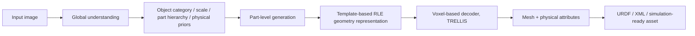

# PhysX-Omni 论文精读

论文：PhysX-Omni: Unified Simulation-Ready Physical 3D Generation for Rigid, Deformable, and Articulated Objects

arXiv 地址：https://arxiv.org/abs/2605.21572v1

arXiv HTML：https://arxiv.org/html/2605.21572

项目主页：https://physx-omni.github.io/

代码仓库：https://github.com/physx-omni/PhysX-Omni

模型权重：https://huggingface.co/PhysX-Omni/PhysX-Omni

数据集 PhysXVerse：https://huggingface.co/datasets/PhysX-Omni/PhysXVerse

版本：v1，2026-05-20

作者：Ziang Cao, Yinghao Liu, Haitian Li, Runmao Yao, Fangzhou Hong, Zhaoxi Chen, Liang Pan, Ziwei Liu

机构：S-Lab, Nanyang Technological University；ACE Robotics

---

## 1. 一句话结论

PhysX-Omni 不是普通的 image-to-3D 模型，而是一个从单张图像生成 simulation-ready 3D 资产的统一框架：它希望同时生成几何、尺度、材料、可交互区域、运动学结构和功能描述，让生成物体可以直接进入物理仿真和机器人训练流程。

这篇论文的核心价值在于把 3D 生成从“看起来像”推进到“在仿真里有物理含义”。它面向的是 embodied AI、机器人仿真、可交互场景构建，而不是单纯的美术资产生成。

---

## 2. 开源状态与许可判断

当前已公开：

- GitHub 代码仓库：`physx-omni/PhysX-Omni`
- Hugging Face 模型权重：`PhysX-Omni/PhysX-Omni`
- Hugging Face 数据集：`PhysX-Omni/PhysXVerse`
- benchmark 代码：仓库内 `benchmark/`

但许可需要分开看：

- 代码仓库使用 `S-Lab License 1.0`，核心限制是非商业用途；商业用途需要联系贡献者。
- PhysXVerse 数据集是 `cc-by-nc-4.0`，也是非商业许可。
- Hugging Face 模型页面标注为 `mit`，但实际使用时仍要结合代码、数据和依赖许可一起判断。

因此，更准确的说法是：研究和学习层面已经开源可用；直接商用或放进产品管线前，需要额外做许可审查。

---

## 3. 论文要解决的问题

过去很多 3D 生成工作关注：

- 几何像不像；
- 纹理好不好；
- 多视角是否一致；
- 渲染出来是否美观。

但仿真和机器人任务还需要更多东西：

- 物体真实尺寸大概是多少；
- 材料是否像金属、木头、塑料、布料；
- 哪些部位可以抓、按、推、拉；
- 是否有门、抽屉、轮子、铰链、滑轨；
- 关节轴、运动范围、运动方式是否合理；
- 在物理引擎中是否稳定、可碰撞、可交互。

论文认为，当前 3D 生成主要有两个缺口：

1. 许多方法只生成外观资产，不生成物理属性。
2. 已有物理 3D 生成方法常常只覆盖刚体、可变形体或铰接体中的一种，缺少统一框架。

PhysX-Omni 的目标是：统一处理刚体、可变形体、铰接物体，并生成可用于仿真的物理 3D 资产。

---

## 4. 输入输出怎么理解

输入：

- 单张完整图像；
- 或单张部分遮挡图像。

输出：

- 3D 几何；
- 部件层级；
- 绝对尺度；
- 材料属性；
- affordance，也就是可交互/可操作区域；
- kinematics，也就是运动学结构，例如关节类型、轴向、运动范围；
- function description，也就是功能和部件语义描述；
- 可转换为 URDF/XML 等仿真结构的资产。

直观理解：

给模型一张“婴儿车”的图，它不只是生成一个看起来像婴儿车的 3D 网格，还要理解轮子能转、扶手可抓、车架是刚性的、布料部分可能可变形、整体尺度约在真实婴儿车范围内。

---

## 5. 方法总览

论文整体流程可以概括为：



核心不是单个 decoder，而是两层设计：

1. VLM 做全局到局部的物理语义推理。
2. 新的几何文本表示让 VLM 能直接生成更细的 3D 结构。

---

## 6. Global-to-local 生成范式

PhysX-Omni 沿用 VLM-based 生成范式。

第一阶段：全局理解。

模型先从图片中判断：

- 这是什么物体；
- 大概真实尺寸是多少；
- 有哪些主要部件；
- 部件之间是什么层级关系；
- 哪些部件可能运动；
- 哪些部位承担交互功能；
- 可能的材料是什么。

第二阶段：局部生成。

模型再逐个部件生成：

- 部件几何；
- 部件语义；
- 部件材料；
- 部件 affordance；
- 部件运动学属性。

这个设计的意义是：物理属性强依赖部件结构。比如门把手、铰链、车轮、抽屉滑轨都不是孤立几何，它们的功能由物体整体结构决定。

---

## 7. 关键创新：template-based RLE 几何表示

论文最关键的技术点是新的几何表示。

以前的方法常见问题：

- 直接生成 mesh token，序列很长；
- 用 VQ-VAE/VQ-GAN 压缩 3D，但需要额外 tokenizer 或特殊 token；
- 用 voxel index 文本表示，但高分辨率结构效率差；
- 依赖分割模块，分割错了后面全错。

PhysX-Omni 的做法：

1. 把物体 voxelize 成体素。
2. 按部件切成 part-level voxel。
3. 每个部件沿 z 轴切成一层层 2D binary mask。
4. 对每个 2D mask 用 RLE，即 run-length encoding，转成紧凑文本。
5. 进一步引入 template layer，让相邻层复用模板，只记录差异或残差。

为什么这有用？

- 3D 物体相邻切片通常很像，模板复用可以压缩冗余。
- RLE 是普通文本，不需要新增语言模型 special tokens。
- VLM 可以直接 autoregressive 地生成几何结构。
- 避免先分割再生成导致的误差传播。
- 更适合细粒度结构，比如轮子、支架、关节连接处。

一句话记忆：

PhysX-Omni 把 3D 部件切成 2D 层，用 RLE 写成文本，再用模板复用相似层，让 VLM 以文本方式生成高分辨率 3D 几何。

---

## 8. 为什么不用纯 mesh 或纯 point cloud

对 VLM 来说，mesh 和 point cloud 都不天然友好：

- mesh 顶点/面片顺序会带来序列建模问题；
- point cloud 缺少显式表面和部件拓扑；
- 高分辨率 voxel 直接展开会太长；
- 压缩 latent 表示虽然短，但解释性和物理部件对齐较弱。

PhysX-Omni 的 template-based RLE 试图在三件事之间折中：

- 保留显式几何结构；
- 让文本序列足够短；
- 与 VLM 的普通 token 空间兼容。

这也是这篇论文区别于纯 3D diffusion 或纯 mesh generation 的地方。

---

## 9. PhysXVerse 数据集

论文构建了 PhysXVerse，用来缓解 sim-ready 物理 3D 数据不足的问题。

数据来源与处理：

- 基于 PartVerse 的人类验证部件分割；
- 过滤无效样本；
- 合并过小或噪声部件；
- 渲染多视角图像；
- 使用 GPT/VLM 生成初步物理标注；
- 再由人类检查、修正、确认。

标注内容：

- absolute scale；
- material；
- affordance；
- kinematics；
- functional description；
- part hierarchy。

规模：

- 超过 8.7K 个高质量 simulation-ready 3D assets；
- 超过 2.9K 类别；
- 部件数量从 1 到 65；
- 覆盖家具、车辆、机器人、无人机、玩具、大场景部件等。

训练时还结合：

- PhysXNet；
- PhysX-Mobility；
- PhysXVerse。

论文称最终训练语料超过 42K 个 simulation-ready physical 3D assets。

---

## 10. PhysX-Bench 评测框架

PhysX-Bench 是论文提出的 benchmark，用来评估真实场景下的 simulation-ready 3D 生成能力。

它评估六个维度：

| 维度 | 评估什么 | 直观例子 |
|---|---|---|
| Geometry | 几何与外观质量 | 形状是否像输入图，多视角是否稳定 |
| Absolute scale | 真实尺度是否合理 | 桌子不能生成成手机大小 |
| Material | 材料物理行为是否合理 | 布料、金属、木头、塑料落地表现不同 |
| Affordance | 可交互区域是否合理 | 把手可抓，座椅可坐，按钮可按 |
| Kinematics | 运动学是否合理 | 门绕铰链转，抽屉沿滑轨平移 |
| Description | 部件语义描述是否一致 | mask 区域是否对应正确部件描述 |

PhysX-Bench 的特点：

- 不完全依赖 ground-truth 物理标注；
- 使用渲染图像和视频作为证据；
- 使用开源 VLM judge 评估复杂物理属性；
- 结合仿真视频，例如自由落体、水滴、运动展示。

这很实用，因为真实 in-the-wild 图片通常没有标准 3D 物理答案。

---

## 11. 各评测项怎么理解

### 11.1 Geometry

包括：

- CLIP score：输入图与生成结果是否语义一致；
- 3D consistency：多视角渲染是否结构一致；
- visual quality：视觉质量分级。

这部分更接近传统 3D 生成评估。

### 11.2 Absolute scale

模型生成一个物体后，需要估计其最大真实尺寸。

评估方式：

- VLM 从条件图像估计真实世界尺寸先验；
- 生成资产有自己的尺寸；
- 两者计算对称百分比误差；
- 转换为尺度合理性分数。

这个指标很关键，因为仿真中的碰撞、抓取、动力学都依赖尺度。

### 11.3 Material

论文用物理行为视频评估材料：

- free-fall：自由落体与地面接触；
- water-drop：水滴/浮沉相关行为。

这些视频可以间接体现：

- density；
- Young's modulus；
- Poisson's ratio；
- 弹性、刚性、柔软度。

注意：这仍是 plausibility 评估，不是实验室测量级物性反演。

### 11.4 Affordance

评估物体哪些部位适合交互。

例子：

- 杯子把手适合抓；
- 椅面适合坐；
- 车轮适合滚动；
- 门把手适合拉；
- 刀刃不应该被标为主要抓握区域。

这个指标依赖常识，因此用 VLM judge 是合理但也有偏差风险的选择。

### 11.5 Kinematics

评估运动学结构是否合理。

它关注：

- 可见部件运动是否与输入图像一致；
- 单视图不可见但生成后暴露的部件运动是否合理；
- 整体铰接结构是否协调。

最后 KPS 是多个子分数的加权平均：

- prior-part motion consistency；
- revealed-entity plausibility；
- global articulation coherence。

### 11.6 Description

将生成 3D 资产的部件 mask 渲染出来，让 VLM 判断该区域是否匹配参考部件描述。

它检验的是部件语义落地能力：

- 不是只生成一个整体外形；
- 而是每个部件是否有正确的语义与功能。

---

## 12. 训练与实现细节

论文实现：

- VLM backbone：Qwen2.5-VL-7B-Instruct；
- 训练 5 个 epoch；
- 64 张 NVIDIA A100；
- 约 14 天；
- 最大序列长度 16,384；
- decoder：TRELLIS；
- 每个对象渲染 25 张多视角 conditioning images。

这说明完整训练复现成本很高。

更现实的复现路线是：

1. 使用公开 checkpoint 做 inference；
2. 跑 demo pipeline；
3. 小规模验证 benchmark；
4. 如果要训练，只先尝试数据预处理和极小规模 finetune。

---

## 13. GitHub 推理管线

仓库 README 给出的推理步骤：

```bash
python download.py
python 1vlm_demo.py        # VLM inference
python 2infer_geo.py       # decoder inference
python 3jsongen_update.py  # convert to URDF & XML
```

安装依赖大致包括：

```bash
git clone --recurse-submodules https://github.com/physx-omni/PhysX-Omni.git
cd PhysX-Omni
conda create -n physx-omni python=3.10
conda activate physx-omni
pip install -r requirements.txt
```

注意：仓库还依赖 TRELLIS、Qwen、CUDA 相关包和若干 3D/渲染工具。Windows 本地完整跑通可能会比较折腾，更适合 Linux + NVIDIA GPU 环境。

---

## 14. Benchmark 代码可用性

仓库内包含 `benchmark/` 目录，README 描述了 metric-first benchmark pipeline。

大体流程：

```text
physx_result/ model outputs
  -> generate metric evidence assets
  -> build one manifest per metric
  -> run VLM judge with corresponding prompt
  -> aggregate raw JSON outputs into CSV summaries
```

公开指标包括：

- RQS：Render Quality Score；
- MCS：Multi-view Consistency Score；
- DCS：Description Consistency Score；
- DQS：Dimension Quality Score；
- APS：Affordance Plausibility Score；
- KPS：Kinematic Plausibility Score；
- MPS：Material Plausibility Score。

这部分很有价值，因为论文不只是给结论，还给了可复用的物理 3D 生成评测骨架。

---

## 15. 主要实验结果

### 15.1 常规指标

论文在 PhysXVerse 和 PhysX-Mobility 上比较：

- Articulate-Anything；
- MonoArt；
- PhysXGen；
- PhysX-Anything；
- PhysX-Omni。

PhysXVerse 上关键结果：

| 方法 | PSNR | CD | F-score | Absolute scale | Material | Affordance | Kinematic | Description |
|---|---:|---:|---:|---:|---:|---:|---:|---:|
| PhysXGen | 19.41 | 15.19 | 83.56 | 309.31 | 16.51 | 9.40 | 0.3494 | 11.84 |
| PhysX-Anything | 15.97 | 37.06 | 40.46 | 298.19 | 15.65 | 10.50 | 0.4191 | 21.38 |
| PhysX-Omni | 21.52 | 2.95 | 91.28 | 2.79 | 27.23 | 21.47 | 0.9185 | 31.05 |

核心变化：

- 几何更好：PSNR 更高，CD 更低，F-score 更高；
- 尺度误差大幅下降；
- kinematic 分数提升非常明显；
- material、affordance、description 也明显提升。

这支持作者的论点：显式高分辨率几何表示对物理属性和运动学推理有帮助。

### 15.2 PhysX-Bench 指标

PhysX-Bench 上结果：

| 方法 | CLIP | 3D Consistency | Visual Quality | Absolute scale | Material | Affordance | Kinematic | Description |
|---|---:|---:|---:|---:|---:|---:|---:|---:|
| Articulate-Anything | 0.554 | 55.27 | 88.46 | - | - | - | 71.25 | - |
| MonoArt | 0.835 | 82.56 | 96.20 | - | - | - | 68.32 | - |
| PhysXGen | 0.803 | 73.50 | 85.93 | 24.21 | - | 66.07 | 69.17 | 22.24 |
| PhysX-Anything | 0.547 | 52.71 | 70.81 | 50.20 | 44.70 | 59.96 | 65.99 | 26.89 |
| PhysX-Omni | 0.767 | 64.48 | 90.00 | 64.26 | 59.89 | 70.57 | 80.72 | 39.02 |

重要细节：

- MonoArt 在 CLIP、3D consistency、visual quality 上更高；
- PhysX-Omni 在 absolute scale、material、affordance、kinematic、description 上更强；
- 因此它不是纯视觉质量第一，而是物理可用性更均衡。

---

## 16. 消融实验结论

论文主要验证 template-based geometry representation 的作用。

对比基线：

- 直接用 text-based voxel indices 表示 3D 结构；
- 或依赖旧的 segmentation pipeline。

结果显示新表示带来：

- 更好的复杂结构生成；
- 更少分割错误累积；
- 更清晰的局部几何；
- 更稳定的部件连接；
- 更合理的铰接结构；
- 更好的尺度和运动学分数。

直观例子：

对婴儿车、拖拉机、轮式结构这类复杂对象，旧方法容易出现轮子破碎、支架不连贯、关节错位。PhysX-Omni 因为直接建模显式 3D 结构，局部结构更稳定。

---

## 17. 应用：机器人策略学习

论文展示了把生成资产放进物理仿真器中做机器人交互和策略学习。

它强调：

- 几何结构可碰撞；
- 材料属性有物理意义；
- 关节参数可驱动；
- 资产可直接进入仿真环境；
- 适合 contact-rich manipulation。

这里的意义很大：

过去机器人仿真环境构建很依赖人工建模。PhysX-Omni 如果稳定，可以用真实照片自动生成大量带物理属性的训练资产，降低仿真数据构建成本。

但要谨慎：

- 论文展示说明可行性，不等于所有生成资产都能稳定训练策略；
- sim-to-real 仍需要物性校准；
- 接触参数、摩擦、质量分布等细节可能仍需人工修正。

---

## 18. 应用：simulation-ready scene generation

论文还探索了场景级生成：

1. 从输入图像估计深度；
2. 用 2D segmentation 分割对象；
3. 得到粗略 3D layout；
4. 用 PhysX-Omni 生成对象级 sim-ready assets；
5. 插入场景，构建物理合理的仿真环境。

这可以理解为：

PhysX-Omni 是对象级资产生成器；与深度估计、分割、布局重建结合后，可以变成物理场景构建管线的一部分。

---

## 19. 这篇论文真正的贡献

### 贡献 1：统一任务定义

它把 rigid、deformable、articulated 统一放进 simulation-ready physical 3D generation 任务里。

这比“只生成铰接体”或“只生成材质属性”更完整。

### 贡献 2：新的 VLM 友好几何表示

template-based RLE 是论文最核心的方法贡献。

它让 VLM 能在不增加特殊 token 的前提下，以文本形式生成更高分辨率的显式 3D 结构。

### 贡献 3：PhysXVerse 数据集

构建了更大、更广类别、更完整物理标注的数据集。

### 贡献 4：PhysX-Bench 评测

提出面向真实图片和复杂物理属性的评测框架，不只看几何，也看尺度、材料、可交互性和运动学。

### 贡献 5：仿真应用验证

展示生成资产可进入机器人 policy learning 和场景生成流程。

---

## 20. 这篇论文的强点

1. 任务方向清晰：从 visual 3D generation 转向 physical/sim-ready 3D generation。
2. 方法设计务实：不用完全重造 3D decoder，而是结合 VLM 表示学习和 TRELLIS decoder。
3. 数据和 benchmark 都补齐了：不是只提出模型。
4. 评测维度更贴近机器人和仿真任务。
5. 代码、模型、数据、benchmark 都公开，学习和复现实用价值高。

---

## 21. 需要警惕的边界

### 21.1 VLM judge 的主观性

PhysX-Bench 大量依赖 VLM 判断图像和视频证据。

优点：

- 能评估没有 ground-truth 的真实图片；
- 能处理语义、功能、物理合理性这类难量化指标。

风险：

- VLM 可能受提示词影响；
- VLM 对物理直觉可能不稳定；
- 不同模型 judge 结果可能不同；
- 分数高不一定代表仿真动力学真实。

### 21.2 物理属性是合理性，不是测量值

材料、密度、弹性、摩擦等属性很难从单张图像精确反演。

论文更接近生成 physically plausible asset，而不是真实物性测量。

### 21.3 训练成本高

64 张 A100、约 14 天意味着大部分个人用户很难完整训练复现。

实际可行路线是用公开 checkpoint 推理，或做小规模 finetune。

### 21.4 几何质量并非所有指标第一

MonoArt 在一些视觉几何指标上优于 PhysX-Omni。

这说明 PhysX-Omni 的优势主要在物理属性综合能力，而不是单纯渲染美观度。

### 21.5 商业使用受限

代码和数据都有非商业限制，不能简单视为 Apache/MIT 风格的自由商用项目。

---

## 22. 和前序工作的关系

### PhysXGen / PhysX-3D

PhysXGen 更偏 physical-grounded 3D asset generation，关注物理属性注入。

PhysX-Omni 进一步扩展到更统一的 simulation-ready 生成，并覆盖刚体、可变形体、铰接体。

### PhysX-Anything

PhysX-Anything 已经尝试从单图生成 sim-ready physical 3D assets。

PhysX-Omni 相比它的关键改进：

- 数据更广；
- 几何表示更强；
- 不再强依赖额外 segmentation；
- 运动学和复杂结构表现更好。

### TRELLIS

TRELLIS 是 decoder 角色。

PhysX-Omni 不是替代 TRELLIS，而是用 VLM 生成结构化物理/几何表示，再调用 TRELLIS 解码成 mesh。

---

## 23. 如果我要复现，建议路线

### 第一阶段：只读代码和跑轻量 demo

目标：

- 确认 checkpoint 可下载；
- 确认单图推理流程；
- 看输出目录结构；
- 理解 URDF/XML 转换。

重点文件：

- `1vlm_demo.py`
- `2infer_geo.py`
- `3jsongen_update.py`
- `download.py`
- `requirements.txt`

### 第二阶段：理解数据格式

目标：

- 看 PhysXVerse annotation；
- 看 template-based RLE 输入输出格式；
- 看训练数据 template。

重点目录：

- `dataset/`
- `configs/`
- `qwen-vl-finetune/`

### 第三阶段：跑 benchmark smoke test

目标：

- 不先追求完整分数；
- 先跑 tiny smoke test；
- 确认 manifest、aggregation、denominator validation 是否通。

重点命令：

```bash
bash benchmark/scripts/run_tiny_smoke_test.sh
```

### 第四阶段：小规模真实评测

目标：

- 选少量对象；
- 只跑部分指标，例如 RQS、DQS、KPS；
- 保存图像、视频、JSON、CSV 证据。

### 第五阶段：尝试替换输入图片

目标：

- 用自己的物体图片测试；
- 看尺度、关节、affordance 是否合理；
- 观察生成结果是否能导入 MuJoCo/Isaac/其他仿真器。

---

## 24. 对机器人和仿真工作的启发

这篇论文适合关注以下方向的人读：

- 自动生成机器人训练资产；
- 从真实照片构造仿真环境；
- sim-ready asset 数据集建设；
- 物理属性 annotation；
- 3D 生成和 VLM 结合；
- 关节、材料、affordance 统一建模；
- 物理 3D benchmark。

最值得借鉴的是：

1. 资产不是 mesh 文件就结束，而是要带物理结构。
2. 评价不能只看美观，要看能否被仿真器用。
3. 单张图像生成物理属性天然不确定，因此 benchmark 需要评估 plausibility。
4. 物体级生成可以作为场景级仿真生成的组件。

---

## 25. 核心术语表

### Simulation-ready

不是只可视化，而是可以进入物理仿真器，有碰撞、尺度、材料、关节、功能属性。

### Affordance

物体给人或机器人提供的可操作性，例如抓、按、推、拉、坐、踩、旋转。

### Kinematics

物体部件的运动学结构，例如 revolute joint、prismatic joint、joint axis、motion limit。

### Absolute scale

真实世界尺度。对仿真非常重要，因为动力学、接触、抓取都和尺度相关。

### Material

不仅是纹理外观，还包括密度、弹性、硬度等物理含义。

### Template-based RLE

把 3D 体素切成 2D 层，用 run-length encoding 写成文本，再用模板层复用相似结构的压缩表示。

### VLM judge

使用视觉语言模型根据渲染图/视频证据打分，用来评估复杂语义和物理合理性。

---

## 26. 用一句话记住整篇论文

PhysX-Omni 用 VLM 从单图推理物体的全局物理语义，再用 template-based RLE 文本表示生成部件级高分辨率几何，最后解码成带尺度、材料、affordance 和运动学结构的 simulation-ready 3D 资产。

---

## 27. 我的阅读判断

这是一篇很适合作为“物理 3D 生成”路线图来读的论文。

它的模型结果固然重要，但更重要的是它把任务拆成了完整工程链条：

- 数据集：PhysXVerse；
- 表示：template-based RLE；
- 模型：Qwen2.5-VL + TRELLIS；
- 输出：URDF/XML/sim-ready asset；
- 评测：PhysX-Bench；
- 应用：机器人策略学习和场景生成。

如果目标是做真实机器人训练资产，这篇论文不能直接解决所有 sim-to-real 问题，但它给出了一个很有价值的自动资产生成框架。后续真正落地时，需要补上：

- 物性校准；
- 接触参数验证；
- 仿真器兼容性测试；
- 资产稳定性 gate；
- 与机器人任务成功率挂钩的动态评测。

---

## 28. 最适合继续追的问题

1. 单图生成的物理属性到底有多少是真实推断，多少是常识补全？
2. PhysX-Bench 换一个 VLM judge 后排名是否稳定？
3. 生成资产在 MuJoCo、Isaac Sim、Genesis 等不同仿真器中是否一致稳定？
4. URDF/XML 输出是否包含足够可靠的质量、惯量、摩擦、关节限制？
5. 真实机器人任务中，使用这些生成资产训练是否能提升 sim-to-real 表现？
6. template-based RLE 是否能泛化到更复杂拓扑或更高分辨率？
7. 如果换成 TRELLIS.2 或更强 3D decoder，瓶颈会转移到哪里？

---

## 29. 适合引用的 BibTeX

```bibtex
@article{cao2026physxomni,
  title={PhysX-Omni: Unified Simulation-Ready Physical 3D Generation for Rigid, Deformable, and Articulated Objects},
  author={Cao, Ziang and Liu, Yinghao and Li, Haitian and Yao, Runmao and Hong, Fangzhou and Chen, Zhaoxi and Pan, Liang and Liu, Ziwei},
  journal={arXiv preprint arXiv:2605.21572},
  year={2026}
}
```

