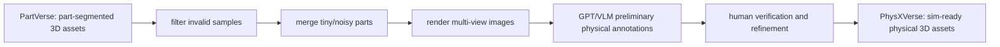

# PhysX-Omni 论文精读 第六步：数据集设计、来源、数量与构建方法

论文地址：[https://arxiv.org/abs/2605.21572v1](https://arxiv.org/abs/2605.21572v1)  
代码地址：[https://github.com/physx-omni/PhysX-Omni](https://github.com/physx-omni/PhysX-Omni)  
PhysXVerse：[https://huggingface.co/datasets/PhysX-Omni/PhysXVerse](https://huggingface.co/datasets/PhysX-Omni/PhysXVerse)  
PhysX-Mobility：[https://huggingface.co/datasets/Caoza/PhysX-Mobility](https://huggingface.co/datasets/Caoza/PhysX-Mobility)  
PhysXNet / PhysX-3D：[https://huggingface.co/datasets/Caoza/PhysX-3D](https://huggingface.co/datasets/Caoza/PhysX-3D)  
PhysX-Bench：[https://huggingface.co/datasets/PhysX-Omni/PhysX-Bench](https://huggingface.co/datasets/PhysX-Omni/PhysX-Bench)

## 0. 这一节先分清楚“数据集”的两层含义

PhysX-Omni 里有两类数据：

1. **训练数据**：用于训练 PhysX-Omni 的 simulation-ready physical 3D assets。核心来源是 PhysXNet、PhysX-Mobility、PhysXVerse，论文说合计超过 `42K` 个物理 3D 资产。
2. **评测数据**：用于无 GT benchmark 的 PhysX-Bench，核心是 `1214` 张 condition images 和 description JSON。第五步已经展开过 Bench，本节只把它放进完整数据版图里。

本文真正新增、最值得重点讲的是 **PhysXVerse**。它是作者为解决数据稀缺和类别不够广的问题构建的 general simulation-ready physical 3D dataset。

## 1. 为什么要新建 PhysXVerse

论文认为现有 3D 生成数据主要有三个问题：

- **几何/外观多，物理少**：很多 3D 数据集有 mesh、texture、render image，但没有绝对尺度、材料、affordance、关节、功能描述等可仿真属性。
- **单一资产类型多，统一物理资产少**：已有工作常常只处理 articulated object 或 deformable object 的某一个子问题，很少统一 rigid、deformable、articulated。
- **类别覆盖窄**：PhysX-Anything / PhysXGen 已经开始做 physical 3D generation，但训练数据多样性仍限制了泛化能力。

因此 PhysXVerse 的目标不是再做一个“看起来像”的 3D 数据集，而是做一个可以训练模型输出 simulation-ready asset 的数据集。每个对象不仅有部件和几何，还要有：

- 真实世界尺度。
- 每个 part 的材料、密度、弹性模量、泊松比。
- part-level affordance rank。
- part-level 基础描述。
- group-level 运动学关系和关节参数。

## 2. 数据集家族总览

| 数据集 | 角色 | 来源 | 论文/卡片中关键数量 | 主要用途 |
|---|---|---|---:|---|
| PhysXNet / PhysX-3D | 早期 physics-grounded 3D 数据 | 基于 PartNet / ShapeNet 体系 | PhysX-3D 论文提到 PhysXNet 约 `26K` assets；HF 当前含 PhysXNet / PhysXNet-XL 大量 zip | 提供物理属性标注和基础 JSON/URDF/XML 结构 |
| PhysX-Mobility | articulated/simulation-ready 数据 | 基于 PartNet-Mobility | PhysX-Anything 称 `2K+` common objects；补充材料给出 `1636` train、`388` test | 增强 articulated / mobility 类型数据 |
| PhysXVerse | 本文新增 general simulation-ready 数据 | 从 PartVerse 筛选、清洗、物理标注 | `8.7K+` assets，`2.9K+` categories，part count `1-65` | 扩大类别和结构复杂度，训练 PhysX-Omni |
| PhysX-Bench | 评测条件图数据 | real-world photos + synthetic rendered images | HF 当前 `1214` images：426 inthewild / 388 mobility / 400 verse | 无 GT 评测 |

训练时作者把 PhysXNet、PhysX-Mobility、PhysXVerse 合并，形成 `42K+` simulation-ready physical 3D assets。每个 object 渲染 `25` 张 conditioning images，因此 object-view 级训练输入规模至少是：

```text
42K objects * 25 views > 1.05M object-view conditioning images
```

实际 VLM 训练样本还会按 part 展开，所以监督条目数会进一步乘以部件数量。

## 3. PhysXVerse 的来源：PartVerse

PhysXVerse 从 PartVerse 筛选和再标注而来。PartVerse 本身来自 CoPart 工作，定位是大规模 3D part dataset：从 Objaverse 中经过 mesh segmentation、人工后处理，并给出 part-level caption。公开资料提到 PartVerse 约 `12K` objects、`91K` parts。

PhysX-Omni 不是直接拿 PartVerse 当训练数据，而是把它进一步变成 simulation-ready physical 3D data：



这一层变化很关键：PartVerse 更偏 part-level geometry / caption，PhysXVerse 增加的是物理世界可用属性。

## 4. PhysXVerse 构建流程

论文和代码合起来可以还原出更具体流程：

### 4.1 清洗与结构整理

论文描述：

- 使用 PartVerse 的 human-verified segmentation annotations。
- 过滤 invalid samples。
- 合并 excessively small or noisy parts，提升结构一致性。

对应目的：

- 减少碎片 part。
- 避免 tiny part 导致 voxel token 过长但语义价值低。
- 保证 group_info 和 part-level geometry 更稳定。

### 4.2 多视角渲染

论文训练设置：

- 每个 object 渲染 `25` 张 conditioning images。
- 这些图片用于训练 VLM 从单图/多视角视觉条件理解几何、part 和物理属性。

README 也写明：

- PhysX-Mobility 和 PhysXVerse 使用 PhysX-Anything 的 `render_cond_mobility.py` 风格工具生成 conditioning images。
- PhysXNet 使用 PhysX-3D 侧的 preprocessing/rendering 工具。

### 4.3 物理属性初标注

论文描述：

- 渲染多视角 images。
- 用强 VLM，也就是 GPT，生成 preliminary physical annotations。
- 标注内容包括 absolute scale、affordance、material、functional descriptions、kinematic information。

这一步不是最终答案，而是自动初稿。

### 4.4 人工验证与 refinement

论文强调 human-in-the-loop：

- 自动标注后由 human annotators verify and refine。
- 目标是保证 physical plausibility 和 annotation quality。

这说明 PhysXVerse 的价值不只是大规模，而是“VLM 初标注 + 人工审校”的可扩展质量控制。

### 4.5 几何归一化与体素化

本地脚本：

```text
dataset/1voxel_verse.py
```

核心处理：

- 读取 `PhysXVerse/partobj/<object_id>/<part_id>/<part_id>.obj`。
- 合并所有 part mesh，计算整体 bbox。
- 把 object 缩放和平移到统一坐标系，大致归一到 `[-0.5, 0.5]`。
- 做一个 `pi/2` 的 x-axis rotation。
- 同步变换 `group_info` 中的关节方向、轴位置、hinge position 等参数。
- 对每个 part 分别体素化，分辨率包括 `16 / 32 / 64`。
- 保存 `ind_<part>.npy` 和 `allind.npy`。

这一步把原始 mesh 数据变成 PhysX-Omni 需要的显式 3D voxel 监督。

### 4.6 JSON 到结构化文本

本地脚本：

```text
dataset/2encode_representation_64_finetune.py
```

它把 `finaljson/<object_id>.json` 转成模型可读的文本描述：

```text
Name: ...
Category: ...
Dimension: ...
Parts:
l_0: <part name>| <affordance rank>| <material>| <density>| <Young>| <Poisson>| <description>
Group_info:
group_1: [l_0, ...]; Type: C relative to group_0; Param: direction..., axis position..., revolute range...
```

这个文本正是 VLM 第一阶段要学会输出的“structured physical description”。

### 4.7 Template-RLE 几何监督

本地脚本：

```text
dataset/3generate_data_new_64_finetune_rle.py
```

它把每个 part 的 `64^3` voxel 编码成 z-slice 2D RLE，并进一步做 template-based lossless compression：

- 每个 z slice 先变成 2D run-length list。
- 相似 slice 共享 template。
- 每一层记录 template label，加上 adds / removes delta。
- 代码里有 decode 和 roundtrip equality 检查，确认编码是 lossless。

最后每个训练样本形成 Qwen-VL 对话：

```json
{
  "id": "<object_id>_<view_id>",
  "image": "<object_id>/<view_id>.png",
  "data_source": "physx",
  "conversations": [
    {"from": "human", "value": "<image>\\n... structured description prompt ..."},
    {"from": "gpt", "value": "... structured description ..."},
    {"from": "human", "value": "Based on the structured description of l_i, generate its 3D voxel ..."},
    {"from": "gpt", "value": "... template-RLE voxel ..."}
  ],
  "meshlength": "<token count>"
}
```

代码会过滤 `tokennum >= 20000` 的样本，以适配长上下文训练预算。

## 5. PhysXVerse 数据 schema

一个对象 JSON 的顶层结构：

| 字段 | 含义 |
|---|---|
| `object_name` | 对象名 |
| `category` | 类别 |
| `dimension` | 真实物理尺寸，通常是 `L*W*H` cm |
| `parts` | part-level 物理和语义属性 |
| `group_info` | group-level 运动学关系 |

`parts[]` 典型字段：

| 字段 | 含义 |
|---|---|
| `label` | part id |
| `name` | part 名称 |
| `material` | 材料 |
| `density` | 密度 |
| `priority_rank` | affordance rank，通常 1-10 |
| `Basic_description` | part 基础描述 |
| `Young's Modulus (GPa)` | 杨氏模量 |
| `Poisson's Ratio` | 泊松比 |

`group_info` 的运动类型：

| Type | 含义 | 例子 |
|---|---|---|
| A | unconstrained / freely movable | 瓶中水等无固定约束对象 |
| B | prismatic / slide | 抽屉 |
| C | revolute / axis rotation | 门 |
| D | hinge around point | 软管等 hinge-like motion |
| CB | prismatic + revolute | 既能旋转又能滑动的盖子 |
| E | fixed / rigid to world or base group | 固定基座 |

更详细 schema 和脚本字段见：

`C:\Users\robot\Documents\成长学习库\physx_omni_step6_dataset_schema_pipeline.md`

## 6. 当前公开资产体积

我用 Hugging Face API 核对了当前公开仓库结构：

| HF repo | 文件结构 | 当前体积 |
|---|---|---:|
| `PhysX-Omni/PhysXVerse` | `PhysXVerse.zip.part_aa/ab/ac` + `merge.sh` | 约 `104.9 GB` |
| `Caoza/PhysX-Mobility` | `PhysX-Mobility.zip` | 约 `0.87 GB` |
| `Caoza/PhysX-3D` | PhysXNet / PhysXNet-XL 多个 zip 和分卷 zip | 约 `1.83 TB` |
| `PhysX-Omni/PhysX-Bench` | `demo_*/*.png` + `descript_*.json` | 约 `0.87 GB` |

注意：这些是当前 HF 文件体积，不等于论文训练样本数量。论文数量以 asset/object 计，文件体积还受 texture、mesh、render、分卷压缩影响。

## 7. 训练数据怎么接入模型

训练配置在：

```text
qwen-vl-finetune/qwenvl/data/__init__.py
qwen-vl-finetune/scripts/train_physx.sh
```

代码里三路数据名：

```text
physxverse64
physxnet64
physxmobility64
```

每路数据都有：

```python
{
  "annotation_path": "...",  # generated training json
  "data_path": "...",        # rendered conditioning image path
}
```

训练脚本中：

```text
datasets=physxverse64,physxnet64,physxmobility64
model=Qwen/Qwen2.5-VL-7B-Instruct
num_train_epochs=5
learning_rate=2e-5
model_max_length=16384
```

论文说实际训练使用 `64 NVIDIA A100 GPUs` 约 `14` 天，有效 batch size `128`。本地脚本是集群模板，`SBATCH --gres=gpu:8` 只是单节点示例，不代表论文完整训练规模。

## 8. 这套数据设计的核心价值

PhysX-Omni 的数据设计有三个关键点：

1. **把物理属性变成可学习的语言结构**  
   VLM 学到的不只是“这是什么物体”，而是对象名、类别、尺度、part、材料、affordance、关节组和运动参数。

2. **把几何监督变成 VLM 可输出的文本序列**  
   通过 template-RLE，`64^3` voxel 被压进普通文本 token，不需要额外 special tokens 或专门 tokenizer。

3. **把 part-level 结构和 simulation-ready 属性绑定**  
   每个 part 有物理属性，每个 group 有运动关系。这比单个整体 mesh 更适合仿真、机器人交互和下游 scene construction。

## 9. 严谨边界

当前本地没有完整解压 PhysXVerse / PhysXNet / PhysX-Mobility。第六步基于：

- 论文源码。
- 官方 GitHub README 和预处理脚本。
- Hugging Face 当前仓库元数据。
- 本地 demo 输出的 `basic_info.json` 作为 schema 实例。

所以本节可以讲清楚数据设计和构建流程，但不能声称已经完成三大训练数据集的完整本地校验或统计复算。

